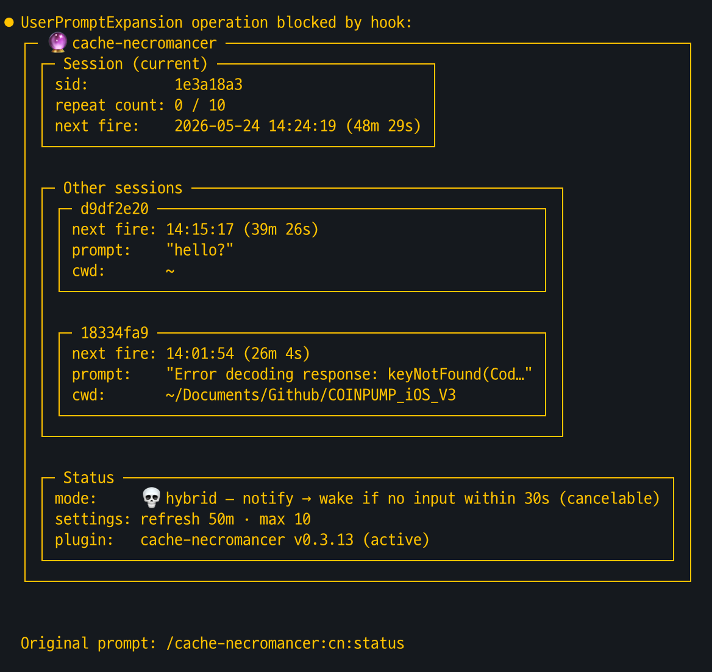
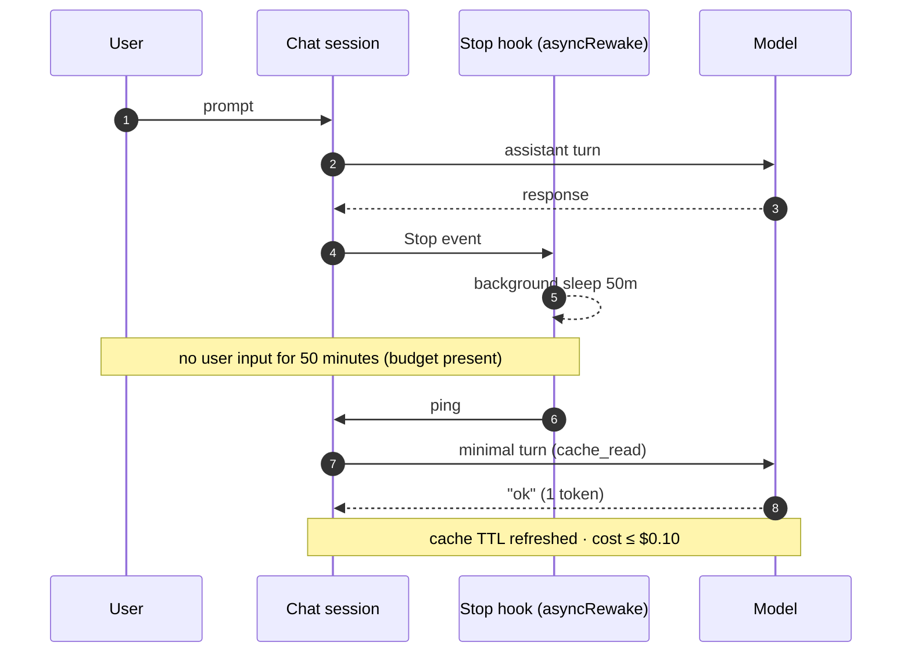

<div align="center">


> **A Claude Code plugin that alerts you before your 1-hour prompt cache expires — and only revives it when you explicitly run `/cn:set`.**

  

[한국어](README.md) · **English**

</div>

---

## The Problem

Claude Code prompt cache TTL = **1 hour**.

| State | Input price (vs base input) |
|---|---|
| Cache valid (`cache_read`) | × 0.1 |
| Cache expired (`cache_create`, 1h ext) | × 2 |
| **🚨 First prompt after 1h (hit → miss)** | **≈ ×20 💸** |

> Meeting / lunch / step away for 50 min → come back → cost bomb.

v0.5.0 default behavior: **notify only** (zero token cost). When you step away, use `/cn:set N` to explicitly charge a wake budget — it revives the cache exactly that many times.

## Install

```bash
/plugin marketplace add token-keeper/plugins
/plugin install cache-necromancer@token-keeper
```

Takes effect from **a new chat session** (Claude Code doesn't hot-reload settings).

## Slash Commands

| Command | Description |
|---|---|
| `/cn:set N` | Charge wake budget — allow N wakes (0=cancel, no arg=status) |
| `/cn:config` | Change settings (arm/notify/interval/max_count) |
| `/cn:status` | Session state + next scheduled fire (no API cost) |

`/cn:status` output:



When a wake fires (budget present), transcript shows:

```
[cn:keepalive 16:42, 3/10] reply with exactly 'ok @16:42 (3/10)'. ...
ok @16:42 (3/10)
```

## How It Works

`~/.cache-necromancer/config.toml` (auto-created on first hook fire):

### Two-axis Configuration

| `notify.enabled` | wake | = legacy mode |
|---|---|---|
| true | off | `notify` (default) |
| false | on | `auto` (immediate wake) |
| true | on | `hybrid` (notify → wait grace_seconds → wake) |
| false | off | Silent — no notify, no wake |

Wake on/off is determined by **`arm` policy × budget**:
- `arm = "manual"` (default): wake only when budget is charged via `/cn:set N`
- `arm = "always"`: auto-arm every turn — forgetting protection, wake cost incurred

**Budget lifecycle** (`arm = "manual"`): `/cn:set N` charges N wake credits → only a real prompt that arrives **after at least one wake has fired since charging** counts as "returning" and clears the remaining budget. Prompts sent right after `/cn:set` (before any wake) keep the budget intact ("set, then one more thing" protection). Each session requires its own `/cn:set`.

### Config file example (v0.5.0)

```toml
[general]
refresh_interval_minutes = 50         # sleep before notify/wake (before cache TTL expires)
cache_ttl_minutes = 60                # Anthropic prompt cache TTL (used for recap timestamp)
max_refresh_count = 10                # wake cap (always chain / set single-charge cap)
language = "en"                       # ko | en | ja | zh

[notify]
enabled = true                        # macOS notification near expiry

[wake]
arm = "manual"                        # manual = wake only after /cn:set / always = auto every turn
grace_seconds = 60                    # delay between notify and wake (when notify.enabled=true)
```

v0.4.x legacy keys (`[general].mode`, `[notify].system_notification`, `[refresh].hybrid_wait_seconds`) are auto-mapped on load, so existing config files continue to work.

## Recap Message

Displayed in Claude Code recap area right after each turn ends (with budget charged):

```
Stop says: 🪦 Cache dies at 09:37.
           🔥 2 wake(s) left — alive until 11:17 at most
```

With zero budget (or `arm = "always"`), only the first line is shown.

4 languages: `ko` / `en` / `ja` / `zh`. Time = `now + cache_ttl_minutes`, user's local time.

## Mechanics

After each turn, a `Stop` hook + `asyncRewake` starts a background sleep.

If there's no user input for `refresh_interval_minutes` and **budget is available**, the chat session **wakes itself** — short ping turn → model replies `ok` (1 token).

Because wake happens inside the chat process, the system prompt + tools stay byte-exact → **cache prefix 100% hit**.

Per-wake cost ≤ $0.10.



## Safety

- **Silent fail**: All hooks silent (exit 0). Never blocks chat.
- **No sensitive data logged**: log = `sid_hash` + token counts only. No prompt/response bodies. 7-day auto-rotate.
- **Permissions**: marker file 0600 / dir 0700.
- **Atomic write**: `tempfile + os.replace()`.

## Caveats

- Not an officially recommended pattern (Anthropic cache policy gray area). For personal use.
- Each wake incurs a minimal turn cost.
- Wake-up turn (`ok @HH:MM`) is permanently recorded in transcript.

## License

MIT — see `LICENSE`.
