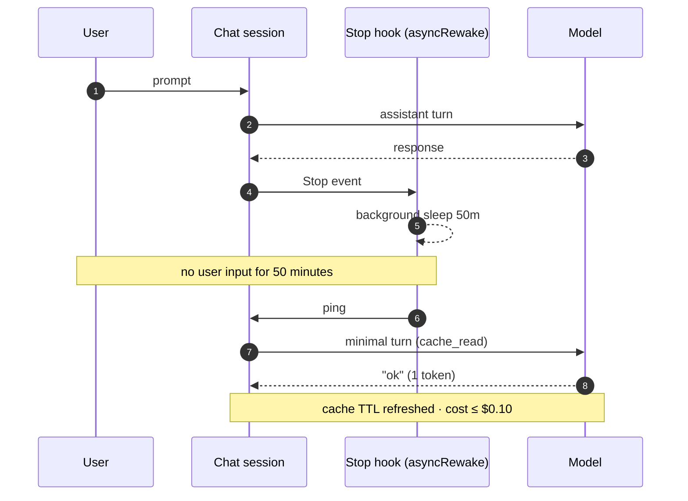

<div align="center">


> **A Claude Code plugin that automatically revives the prompt cache right before its 1-hour TTL expires.**

  

[한국어](README.md) · **English**

</div>

---

## The Problem

Claude Code prompt cache TTL = **1 hour**.

| State | Input price (vs base input) |
|---|---|
| Cache valid (`cache_read`) | × 0.1 |
| Cache expired (`cache_create`, 1h ext) | × 2 |
| **🚨 First prompt after 1h (hit → miss)** | **≈ ×20 💸** |

> Meeting / lunch / step away for 50 min → come back → cost bomb.

## Install

```bash
/plugin marketplace add token-keeper/plugins
/plugin install cache-necromancer@token-keeper
```

Takes effect from **a new chat session** (Claude Code doesn't hot-reload settings).

## Slash Commands

| Command | Description |
|---|---|
| `/cn:config` | Change mode |
| `/cn:status` | Session state + next scheduled fire (no API cost) |

`/cn:status` output:


When a wake fires, transcript shows:

```
[cn:keepalive 16:42, 3/10] reply with exactly 'ok @16:42 (3/10)'. ...
ok @16:42 (3/10)
```

## Modes

`~/.cache-necromancer/config.toml` (auto-created on first hook fire):

| mode | Behavior |
|------|----------|
| `notify` | macOS notification after 50 min (no wake) |
| `auto` | Auto-wake after 50 min |
| `hybrid` (default) | Notify → wake if no input within 60s |

```toml
[general]
mode = "hybrid"
refresh_interval_minutes = 50         # wake interval
cache_ttl_minutes = 60                # used for recap message timestamp
max_refresh_count = 10                # max wakes per session
language = "en"                       # ko | en | ja | zh

[notify]
system_notification = true

[refresh]
hybrid_wait_seconds = 60
```

## Recap Message

Displayed in Claude Code recap area right after each turn ends:

```
Stop says: 🪦 Cache dies at 09:37.
```

4 languages: `ko` / `en` / `ja` / `zh`. Time = `now + cache_ttl_minutes`, user's local time.

## How It Works

After each turn, a `Stop` hook + `asyncRewake` starts a background sleep.

If there's no user input for 50 minutes, the chat session **wakes itself** — short ping turn → model replies `ok` (1 token).

Because wake happens inside the chat process, the system prompt + tools stay byte-exact → **cache prefix 100% hit**.

Per-wake cost ≤ $0.10.



## Safety

- **Silent fail**: All hooks silent (exit 0). Never blocks chat.
- **No sensitive data logged**: log = `sid_hash` + token counts only. No prompt/response bodies. 7-day auto-rotate.
- **Permissions**: marker file 0600 / dir 0700.
- **Atomic write**: `tempfile + os.replace()`.

## Caveats

- Not an officially recommended pattern (Anthropic cache policy gray area). For personal use.
- Each wake incurs a minimal turn cost.
- Wake-up turn (`ok @HH:MM`) is permanently recorded in transcript.

## License

MIT — see `LICENSE`.
