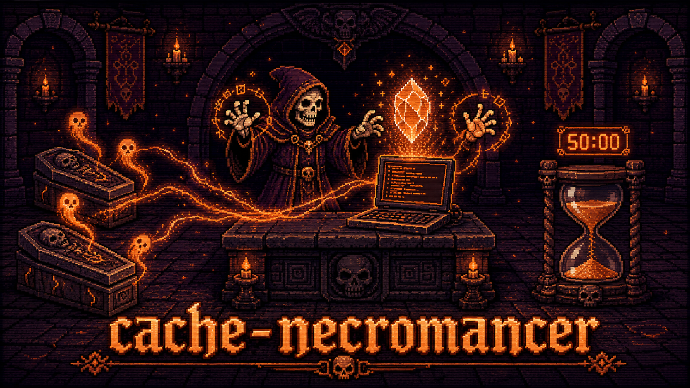
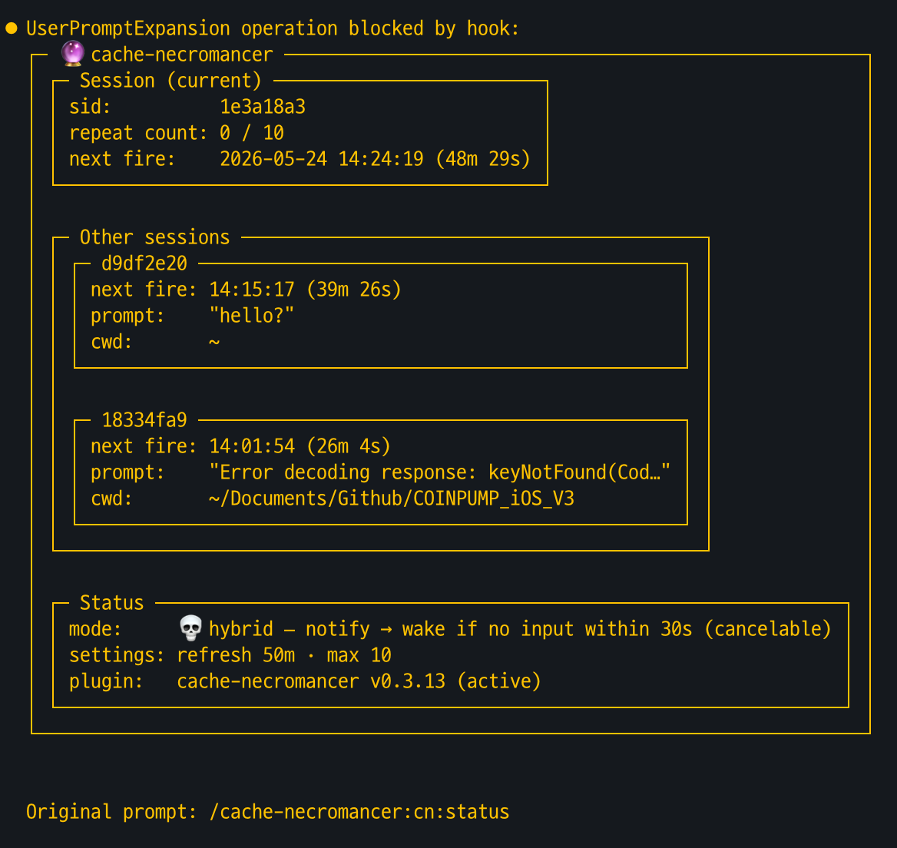
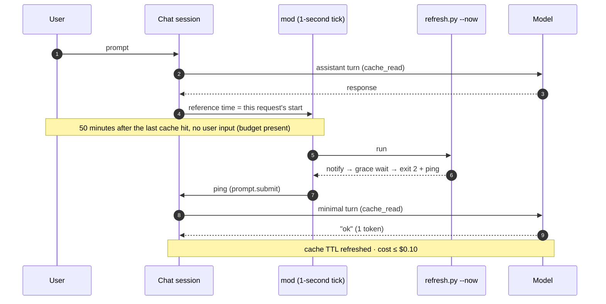

<div align="center">



> **A Claude Code plugin that alerts you before your 1-hour prompt cache expires — and only revives it when you explicitly run `/cn:set`.**

  

[한국어](README.md) · **English**

</div>

---

## The Problem

Claude Code prompt cache TTL = **1 hour**.

| State | Input price (vs base input) |
|---|---|
| Cache valid (`cache_read`) | × 0.1 |
| Cache expired (`cache_create`, 1h ext) | × 2 |
| **🚨 First prompt after 1h (hit → miss)** | **≈ ×20 💸** |

> Meeting / lunch / step away for 50 min → come back → cost bomb.

v0.5.0 default behavior: **notify only** (zero token cost). When you step away, use `/cn:set N` to explicitly charge a wake budget — it revives the cache exactly that many times.

## Install

```bash
/plugin marketplace add token-keeper/plugins
/plugin install cache-necromancer@token-keeper
```

Takes effect from **a new chat session** (Claude Code doesn't hot-reload settings).

## Slash Commands

| Command | Description |
|---|---|
| `/cn:set N` | Charge wake budget — allow N wakes (0=cancel, no arg=status) |
| `/cn:config` | Change settings (arm/notify/interval/max_count/countdown) |
| `/cn:status` | Session state + next scheduled fire (no API cost) |

`/cn:status` output:



When a wake fires (budget present), transcript shows:

```
[cn:keepalive 16:42, 3/10] reply with exactly 'ok @16:42 (3/10)'. ...
ok @16:42 (3/10)
```

## How It Works

`~/.cache-necromancer/config.toml` (auto-created on first hook fire):

### Two-axis Configuration

| `notify.enabled` | wake | = legacy mode |
|---|---|---|
| true | off | `notify` (default) |
| false | on | `auto` (immediate wake) |
| true | on | `hybrid` (notify → wait grace_seconds → wake) |
| false | off | Silent — no notify, no wake |

Wake on/off is determined by **`arm` policy × budget**:
- `arm = "manual"` (default): wake only when budget is charged via `/cn:set N`
- `arm = "always"`: auto-arm every turn — forgetting protection, wake cost incurred

**Budget lifecycle** (`arm = "manual"`): `/cn:set N` charges N wake credits → only a real prompt that arrives **after at least one wake has fired since charging** counts as "returning" and clears the remaining budget. Prompts sent right after `/cn:set` (before any wake) keep the budget intact ("set, then one more thing" protection). Each session requires its own `/cn:set`.

### Config file example (v0.5.0)

```toml
[general]
refresh_interval_minutes = 50         # sleep before notify/wake (before cache TTL expires)
cache_ttl_minutes = 60                # Anthropic prompt cache TTL (used for recap timestamp)
max_refresh_count = 10                # wake cap (always chain / set single-charge cap)
language = "en"                       # ko | en | ja | zh

[notify]
enabled = true                        # macOS notification near expiry

[wake]
arm = "manual"                        # manual = wake only after /cn:set / always = auto every turn
grace_seconds = 60                    # delay between notify and wake (when notify.enabled=true)

[display]
recap_style = "compact"               # compact = one line / box = large box
countdown = true                      # cache countdown in the band above the prompt (Claude Code v2.1.286+)
```

v0.4.x legacy keys (`[general].mode`, `[notify].system_notification`, `[refresh].hybrid_wait_seconds`) are auto-mapped on load, so existing config files continue to work.

## Recap Message

Displayed in Claude Code recap area right after each turn ends (with budget charged):

```
Stop says: 🪦 Cache dies at 09:37.
           🔥 2 wake(s) left — alive until 11:17 at most
```

With zero budget (or `arm = "always"`), only the first line is shown.

4 languages: `ko` / `en` / `ja` / `zh`. Time = `now + cache_ttl_minutes`, user's local time.

## Countdown Band (v0.9.0)

Once all work is done and Claude is waiting for your input, the band right above the prompt shows the time left before the cache dies, ticking down every second.

```
  Cache 59:11 left       (language = "en", default)
  캐시 59:11 남음        (language = "ko")
```

- The reference time is the last main-conversation model request that actually read or wrote the cache (subagent requests and failed requests don't count). Wake turns are main-conversation requests too, so they should restart the count from 60:00 (not yet observed).
- The recap's expiry time counts from the Stop time while the band counts from the **start** of the last cache request, so the two can differ by a few minutes (the longer the answer, the earlier the band calls expiry).
- After `refresh_interval_minutes` (default 50 → 10 minutes left) the line turns orange (#ffb454) with a `Cache: 10 min left` toast; after `cache_ttl_minutes` it shows `Cache expired` in red (#ff7b7b) with a toast. Each fires once per reference time.
- **Hidden while work is running** — while Claude is answering, or while a background agent (subagent etc.) is still `pending`/`running`/`waiting` after the main turn ended. The cache clock keeps running, so warning and expiry toasts still fire meanwhile. Also hidden while a survey holds the band.
  - A teammate in its own terminal window may stay `running` after its window is closed or dies, and the band can stay hidden meanwhile.
- Nothing is shown before the first request of a session (or after `/clear`).
- Right after `/compact` the band is cleared too, and counting restarts from the next answer's cache request (v0.9.1). An automatic compact in the middle of an answer leaves it as is.
- `[display] countdown = false` turns off both the band and the toasts (the expiry notification and wake keep working). Text follows `[general] language` (ko/en/ja/zh, default en). Settings are **read at session start, so changes apply from a new chat session**.
- If the config file has a syntax error, the Python side (recap, wake) drops the whole file and uses defaults, while the band uses the values on the lines it can read, so their TTL and warning time can differ.
- With the what-did-i-say plugin's band box, this line sits on top and the request box below it.

**Requires Claude Code v2.1.286 or later** (mods = function-hook plugins, loaded through the `modules` entry of `hooks/hooks.json`). Since v0.10.0 the mod also runs the expiry notification and wake, so on v2.1.200–v2.1.241, where the `modules` key is ignored without error, the band, notifications and wake are all missing and only recap and `/cn:*` remain (`modules` being ignored measured on v2.1.200 and later; older versions not checked). On v2.1.242–v2.1.285 mods sit behind a server rollout flag, so the band, notifications and wake may work depending on the environment (flag-on environments not tested). Evidence: measured on 2026-10-07 with an isolated config on v2.1.200, v2.1.241 and v2.1.242–v2.1.286; `claude plugin test` passes on v2.1.287, v2.1.290, v2.1.291 and v2.1.292.

## Mechanics

The mod (`hooks/register.tsx`) counts with a 1-second tick from the start of the last main-conversation request that read or wrote the cache (the band's reference time).

Once `refresh_interval_minutes` have passed, it runs `scripts/refresh.py --now` once. If there was no user input after the reference time and **budget is available**, it notifies → waits `grace_seconds` → re-checks and emits a ping, which the mod submits as a prompt so the chat session **wakes itself** — short ping turn → model replies `ok` (1 token). Without budget it only notifies.

When the wake turn reads the cache, the reference time moves and the next cycle follows (capped by the budget and `max_refresh_count`). A reference time already past `cache_ttl_minutes` (e.g. after sleep) does not wake. Up to v0.9.x a `Stop` hook + `asyncRewake` started a Python process that slept 50 minutes after every turn; since v0.10.0 there is no waiting process.

- If `refresh_interval_minutes` is not below `cache_ttl_minutes`, there is no window to wake in, so wake is off; a toast says so at session start.
- If `grace_seconds` exceeds about 9 minutes 30 seconds, the platform's run time limit (10 minutes) cuts the run and no wake happens.

Because wake happens inside the chat process, the system prompt + tools stay byte-exact → **cache prefix 100% hit**.

Per-wake cost ≤ $0.10.


```mermaid
sequenceDiagram
    autonumber
    participant U as User
    participant C as Chat session
    participant H as mod (1-second tick)
    participant P as refresh.py --now
    participant M as Model

    U->>C: prompt
    C->>M: assistant turn (cache_read)
    M-->>C: response
    C->>H: reference time = this request's start

    Note over U,H: 50 minutes after the last cache hit, no user input (budget present)

    H->>P: run
    P-->>H: notify → grace wait → exit 2 + ping
    H->>C: ping (prompt.submit)
    C->>M: minimal turn (cache_read)
    M-->>C: "ok" (1 token)

    Note over C,M: cache TTL refreshed · cost ≤ $0.10
```

## Safety

- **Silent fail**: All hooks silent (exit 0). Never blocks chat.
- **No sensitive data logged**: log = `sid_hash` + token counts only. No prompt/response bodies. 7-day auto-rotate.
- **Permissions**: marker file 0600 / dir 0700.
- **Atomic write**: `tempfile + os.replace()`.

## Caveats

- Not an officially recommended pattern (Anthropic cache policy gray area). For personal use.
- Each wake incurs a minimal turn cost.
- Wake-up turn (`ok @HH:MM`) is permanently recorded in transcript.

## License

MIT — see `LICENSE`.
