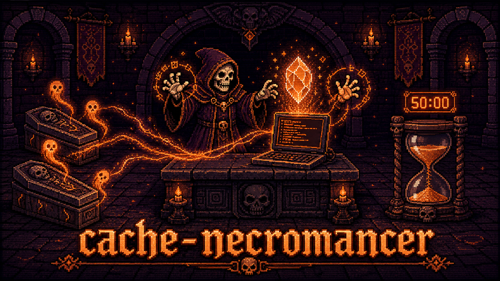
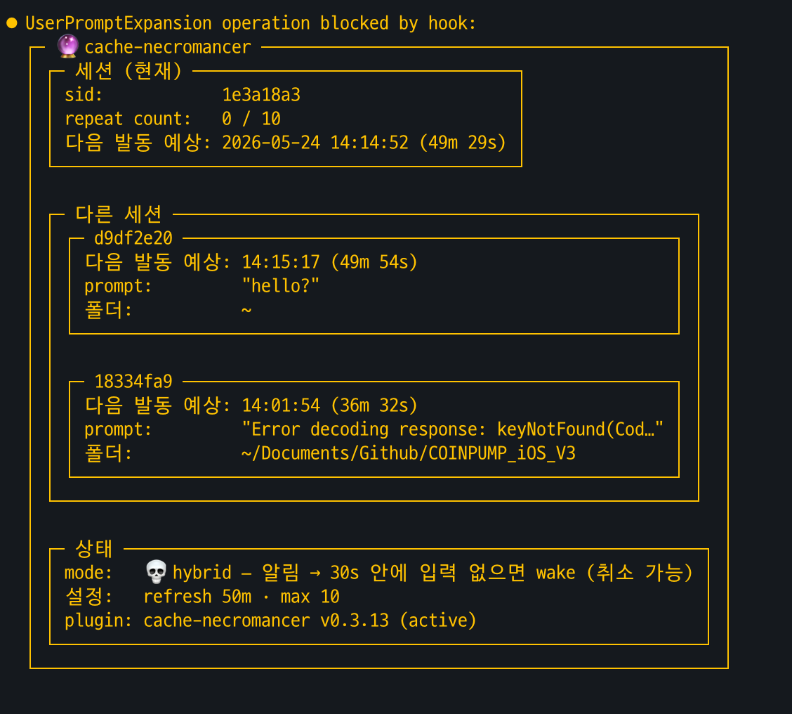
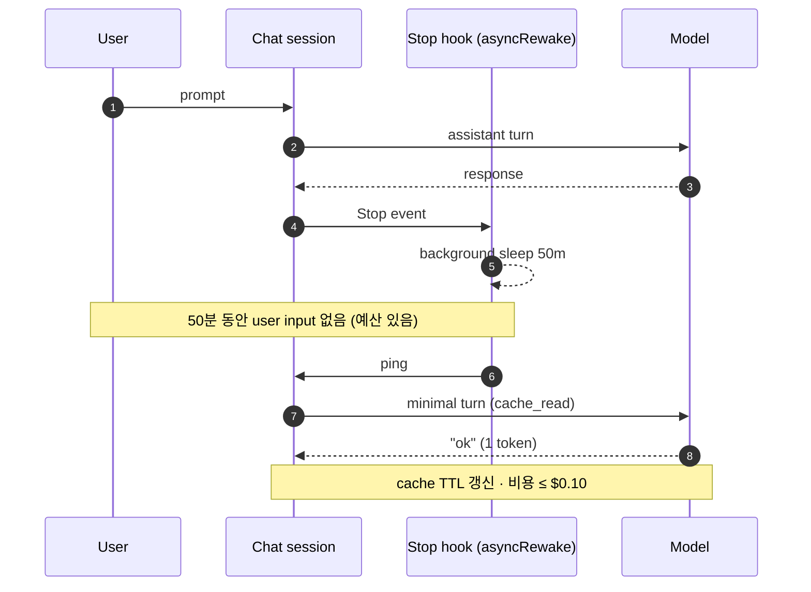

<div align="center">



> **Claude Code 1시간 프롬프트 캐시 만료 직전에 알려주고, `/cn:set` 한 만큼만 살린다.**

  

**한국어** · [English](README.en.md)

</div>

---

## 무엇이 문제인가

Claude Code 프롬프트 캐시 TTL = **1 시간**.

| 상황 | input 단가 (base input 대비) |
|---|---|
| 캐시 유효 (`cache_read`) | × 0.1 |
| 캐시 만료 후 (`cache_create`, 1h ext) | × 2 |
| **🚨 1시간 후 첫 입력 (hit → miss)** | **≈ ×20 💸** |

> 회의 / 점심 / 자리 비움 50분 → 돌아와서 작업 재개 → 비용 폭탄.

v0.5.0 기본 동작: **알림만** (토큰 지출 0). 자리를 비울 때 `/cn:set N` 으로 wake 예산을 명시적으로 충전하면 그만큼만 살린다.

## 설치

```bash
/plugin marketplace add token-keeper/plugins
/plugin install cache-necromancer@token-keeper
```

설치 후 **새 chat 세션** 부터 적용 (Claude Code settings hot-reload 안 함).

## 슬래시 명령

| 명령 | 설명 |
|---|---|
| `/cn:set N` | 예산 충전 — N회 wake 허용 (0=취소, 무인자=상태 표시) |
| `/cn:config` | 동작 설정 변경 (arm/notify/interval/max_count) |
| `/cn:status` | 세션 상태 + 다음 발동 예상 (API 비용 0) |

`/cn:status` 출력 예시:



예산이 있을 때 wake 발생 시 transcript:

```
[cn:keepalive 16:42, 3/10] reply with exactly 'ok @16:42 (3/10)'. ...
ok @16:42 (3/10)
```

## 작동 방식

`~/.cache-necromancer/config.toml` (첫 hook fire 시 자동 생성):

### 2축 설정

| `notify.enabled` | wake | = 구 mode |
|---|---|---|
| true | off | `notify` (기본) |
| false | on | `auto` (즉시 wake) |
| true | on | `hybrid` (알림 → grace_seconds 후 wake) |
| false | off | 알림도 wake도 없음 |

wake on/off 는 **`arm` 정책 × 예산** 으로 결정:
- `arm = "manual"` (기본): `/cn:set N` 으로 예산 충전 시에만 wake
- `arm = "always"`: 매 turn 자동 arm — 깜빡 보호, wake 비용 발생

**예산 lifecycle** (`arm = "manual"`): `/cn:set N` 으로 N회 wake 예산 충전 → 복귀 후 실제 입력이 들어오면 잔여 예산 자동 소멸. 다른 세션은 별도 `/cn:set` 필요.

### 설정 파일 예시 (v0.5.0)

```toml
[general]
refresh_interval_minutes = 50         # cache TTL 만료 직전 알림/wake 까지의 sleep
cache_ttl_minutes = 60                # Anthropic prompt cache TTL (recap 표시용)
max_refresh_count = 10                # wake 상한 (always 연쇄 / set 1회 충전 상한)
language = "en"                       # 메시지 언어: ko | en | ja | zh

[notify]
enabled = true                        # 만료 임박 macOS 알림

[wake]
arm = "manual"                        # manual = /cn:set 시에만 소생 / always = 매 turn 자동
grace_seconds = 60                    # 알림 후 wake 까지 대기 (notify.enabled=true 일 때)
```

v0.4.x legacy 키 (`[general].mode`, `[notify].system_notification`, `[refresh].hybrid_wait_seconds`) 는 로드 시 자동 매핑되어 기존 설정 파일도 그대로 동작한다.

## Recap 메시지

매 turn 종료 직후 cache 만료 시각 표시:

```
Stop says: 🪦 Cache dies at 09:37.
```

예산 충전 시 2번째 줄에 남은 wake 횟수 표시.

`language` 4종: `ko` / `en` / `ja` / `zh`. 시각 = `now + cache_ttl_minutes`, 사용자 시스템 local time.

## 어떻게 동작하는가

매 turn 끝마다 `Stop` hook + `asyncRewake` 로 background sleep 시작.

`refresh_interval_minutes` 동안 user input 이 없고 **예산이 있으면** chat 세션이 **자기 자신을 wake** — 짧은 ping turn → 모델 `ok` 1 token.

chat 프로세스 내부에서 wake 하므로 system prompt + tools 가 byte-exact 보존됨 → **cache prefix 100% hit**.

wake 1회 비용 ≤ $0.10.



## 안전성

- **Silent fail**: 모든 hook silent (exit 0). chat 동작 차단 X.
- **민감정보 미기록**: log = `sid_hash` + token 수만. 본문 기록 X. 7일 자동 회전.
- **권한**: marker file 0600 / dir 0700.
- **Atomic write**: `tempfile + os.replace()`.

## 비추천 / 주의

- 공식 권장 패턴 아님 (Anthropic 캐시 정책 회색지대). 개인 사용 목적.
- 매 wake = minimal turn 비용 발생.
- wake-up turn (`ok @HH:MM`) 은 영구 transcript 기록.

## 라이선스

MIT — `LICENSE` 참조.
