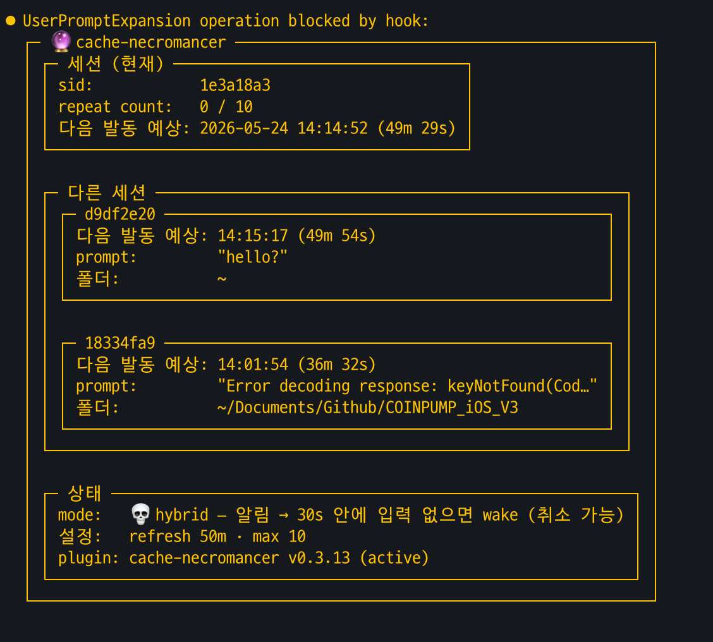
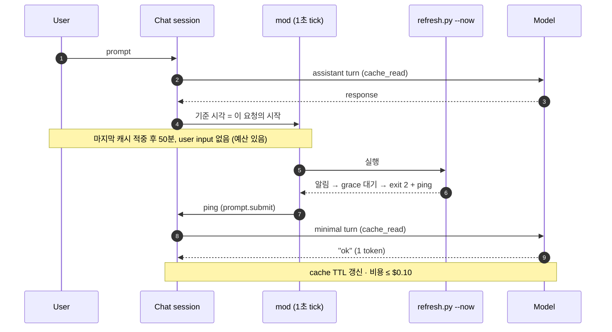

<div align="center">


> **Claude Code 1시간 프롬프트 캐시 만료 직전에 알려주고, `/cn:set` 한 만큼만 살린다.**

  

**한국어** · [English](README.en.md)

</div>

---

## 무엇이 문제인가

Claude Code 프롬프트 캐시 TTL = **1 시간**.

| 상황 | input 단가 (base input 대비) |
|---|---|
| 캐시 유효 (`cache_read`) | × 0.1 |
| 캐시 만료 후 (`cache_create`, 1h ext) | × 2 |
| **🚨 1시간 후 첫 입력 (hit → miss)** | **≈ ×20 💸** |

> 회의 / 점심 / 자리 비움 50분 → 돌아와서 작업 재개 → 비용 폭탄.

v0.5.0 기본 동작: **알림만** (토큰 지출 0). 자리를 비울 때 `/cn:set N` 으로 wake 예산을 명시적으로 충전하면 그만큼만 살린다.

## 설치

```bash
/plugin marketplace add token-keeper/plugins
/plugin install cache-necromancer@token-keeper
```

설치 후 **새 chat 세션** 부터 적용 (Claude Code settings hot-reload 안 함).

## 슬래시 명령

| 명령 | 설명 |
|---|---|
| `/cn:set N` | 예산 충전 — N회 wake 허용 (0=취소, 무인자=상태 표시) |
| `/cn:config` | 동작 설정 변경 (arm/notify/interval/max_count/countdown) |
| `/cn:status` | 세션 상태 + 다음 발동 예상 (API 비용 0) |

`/cn:status` 출력 예시:



예산이 있을 때 wake 발생 시 transcript:

```
[cn:keepalive 16:42, 3/10] reply with exactly 'ok @16:42 (3/10)'. ...
ok @16:42 (3/10)
```

## 작동 방식

`~/.cache-necromancer/config.toml` (첫 hook fire 시 자동 생성):

### 2축 설정

| `notify.enabled` | wake | = 구 mode |
|---|---|---|
| true | off | `notify` (기본) |
| false | on | `auto` (즉시 wake) |
| true | on | `hybrid` (알림 → grace_seconds 후 wake) |
| false | off | 알림도 wake도 없음 |

wake on/off 는 **`arm` 정책 × 예산** 으로 결정:
- `arm = "manual"` (기본): `/cn:set N` 으로 예산 충전 시에만 wake
- `arm = "always"`: 매 turn 자동 arm — 깜빡 보호, wake 비용 발생

**예산 lifecycle** (`arm = "manual"`): `/cn:set N` 으로 N회 wake 예산 충전 → **충전 후 wake 가 1회 이상 일어난 뒤** 들어온 진짜 입력만 복귀로 간주해 잔여 예산 자동 소멸. set 직후 (아직 wake 없음) 추가 프롬프트는 예산을 유지한다 ("set 치고 하나만 더" 보호). 다른 세션은 별도 `/cn:set` 필요.

### 설정 파일 예시 (v0.5.0)

```toml
[general]
refresh_interval_minutes = 50         # cache TTL 만료 직전 알림/wake 까지의 sleep
cache_ttl_minutes = 60                # Anthropic prompt cache TTL (recap 표시용)
max_refresh_count = 10                # wake 상한 (always 연쇄 / set 1회 충전 상한)
language = "en"                       # 메시지 언어: ko | en | ja | zh

[notify]
enabled = true                        # 만료 임박 macOS 알림

[wake]
arm = "manual"                        # manual = /cn:set 시에만 소생 / always = 매 turn 자동
grace_seconds = 60                    # 알림 후 wake 까지 대기 (notify.enabled=true 일 때)

[display]
recap_style = "compact"               # compact = 한 줄 / box = 박스로 크게
countdown = true                      # 프롬프트 위 띠에 캐시 남은 시간 카운트다운 (Claude Code v2.1.286+)
```

v0.4.x legacy 키 (`[general].mode`, `[notify].system_notification`, `[refresh].hybrid_wait_seconds`) 는 로드 시 자동 매핑되어 기존 설정 파일도 그대로 동작한다.

## Recap 메시지

매 turn 종료 직후 cache 만료 시각 표시 (예산 있을 때):

```
Stop says: 🪦 Cache dies at 09:37.
           🔥 wake 2회 남음 — 최대 11:17까지 생존
```

예산 0 (또는 `arm = "always"`) 이면 1줄만 표시.

`language` 4종: `ko` / `en` / `ja` / `zh`. 시각 = `now + cache_ttl_minutes`, 사용자 시스템 local time.

## 카운트다운 띠 (v0.9.0)

모든 작업이 끝나 입력을 기다리는 동안, 프롬프트 바로 위 띠에 캐시가 죽기까지 남은 시간을 1초씩 줄여 보여준다.

```
  캐시 59:11 남음        (language = "ko")
  Cache 59:11 left       (language = "en", 기본)
```

- 기준 시각은 메인 대화에서 캐시를 실제로 읽거나 쓴 마지막 모델 요청이다 (서브에이전트 요청·실패한 요청은 세지 않는다). wake turn 도 메인 대화의 요청이라 다시 60:00 부터 셀 것으로 예상한다 (실측 전).
- recap 의 만료 시각은 Stop 시각 기준이고 띠는 마지막 캐시 요청의 **시작** 시각 기준이라, 둘이 몇 분 차이 날 수 있다 (긴 답변일수록 띠가 더 이르게 만료를 알린다).
- `refresh_interval_minutes` 가 지나면(기본 50분 → 남은 10분) 주황(#ffb454) + `캐시 10분 남음` 토스트, `cache_ttl_minutes` 가 지나면 `캐시 만료` 빨강(#ff7b7b) + 토스트. 같은 기준 시각에서는 한 번씩만 알린다.
- **작업 중에는 숨는다** — 답변 중이거나, 리더 턴이 끝났어도 백그라운드 에이전트(서브에이전트 등)가 실행 중(`pending`·`running`·`waiting`)이면 띠를 그리지 않는다. 캐시 시계는 흐르므로 그동안에도 경고·만료 토스트는 울린다. 설문이 띠를 쓰는 동안에도 숨는다.
  - 별도 터미널 창의 팀메이트는 창이 닫히거나 죽어도 상태가 `running` 으로 남을 수 있고, 그동안 띠가 계속 숨을 수 있다.
- 세션이 시작된 뒤(또는 `/clear` 뒤) 첫 요청 전에는 아무것도 표시하지 않는다.
- `/compact` 직후에도 띠를 비우고, 다음 답변에서 캐시를 쓴 요청부터 다시 센다 (v0.9.1). 답변 도중 자동 compact 는 그대로 둔다.
- `[display] countdown = false` 면 띠와 토스트를 모두 끈다 (만료 임박 알림·wake 는 그대로 동작). 문구는 `[general] language`(ko·en·ja·zh, 기본 en)를 따른다. 설정은 **세션 시작 때 읽으므로 바꾼 뒤 새 chat 세션부터** 적용된다.
- 설정 파일에 문법 오류가 있으면 Python 쪽(recap·wake)은 파일 전체를 버리고 기본값을 쓰지만, 띠는 읽을 수 있는 줄의 값만 쓴다. 그래서 둘의 TTL·경고 시점이 다를 수 있다.
- what-did-i-say 플러그인의 띠 박스와 함께 쓰면 이 줄이 위, 요청 박스가 아래로 붙는다.

**요구: Claude Code v2.1.286 이상** (mods = 함수 훅 플러그인, `hooks/hooks.json` 의 `modules` 항목으로 로드). v0.10.0 부터는 만료 임박 알림과 wake 도 mod 가 실행하므로, v2.1.200~v2.1.241 에서는 `modules` 키가 오류 없이 무시되어 띠·알림·wake 가 빠지고 recap·`/cn:*` 만 남는다 (`modules` 무시는 v2.1.200 이상에서 실측, 그 미만은 미확인). v2.1.242~v2.1.285 는 mods 가 서버 롤아웃 플래그 뒤에 있어 환경에 따라 띠·알림·wake 가 동작할 수도 있다 (플래그가 켜진 환경은 추정). 근거: 2026-10-07 격리 설정으로 v2.1.200·v2.1.241·v2.1.242~v2.1.286 실측, v2.1.287·v2.1.290·v2.1.291·v2.1.292 에서 `claude plugin test` 통과.

## 어떻게 동작하는가

mod(`hooks/register.tsx`)가 메인 대화에서 캐시를 마지막으로 읽거나 쓴 요청의 시작 시각부터 1초 tick 으로 센다 (띠와 같은 기준 시각).

`refresh_interval_minutes` 가 지나면 `scripts/refresh.py --now` 를 1회 실행한다. 그 사이 user input 이 없고 **예산이 있으면** 알림 → `grace_seconds` 대기 → 재확인 후 ping 을 내고, mod 가 그 ping 을 프롬프트로 제출해 chat 세션이 **자기 자신을 wake** — 짧은 ping turn → 모델 `ok` 1 token. 예산이 없으면 알림만 띄운다.

wake turn 이 캐시를 읽으면 기준 시각이 갱신되어 다음 주기로 이어진다 (상한은 예산·`max_refresh_count`). v0.9.x 까지는 매 turn 끝 `Stop` hook + `asyncRewake` 가 50분 sleep 하는 Python 프로세스를 띄웠지만, v0.10.0 부터 대기 프로세스는 없다.

chat 프로세스 내부에서 wake 하므로 system prompt + tools 가 byte-exact 보존됨 → **cache prefix 100% hit**.

wake 1회 비용 ≤ $0.10.


```mermaid
sequenceDiagram
    autonumber
    participant U as User
    participant C as Chat session
    participant H as mod (1초 tick)
    participant P as refresh.py --now
    participant M as Model

    U->>C: prompt
    C->>M: assistant turn (cache_read)
    M-->>C: response
    C->>H: 기준 시각 = 이 요청의 시작

    Note over U,H: 마지막 캐시 적중 후 50분, user input 없음 (예산 있음)

    H->>P: 실행
    P-->>H: 알림 → grace 대기 → exit 2 + ping
    H->>C: ping (prompt.submit)
    C->>M: minimal turn (cache_read)
    M-->>C: "ok" (1 token)

    Note over C,M: cache TTL 갱신 · 비용 ≤ $0.10
```

## 안전성

- **Silent fail**: 모든 hook silent (exit 0). chat 동작 차단 X.
- **민감정보 미기록**: log = `sid_hash` + token 수만. 본문 기록 X. 7일 자동 회전.
- **권한**: marker file 0600 / dir 0700.
- **Atomic write**: `tempfile + os.replace()`.

## 비추천 / 주의

- 공식 권장 패턴 아님 (Anthropic 캐시 정책 회색지대). 개인 사용 목적.
- 매 wake = minimal turn 비용 발생.
- wake-up turn (`ok @HH:MM`) 은 영구 transcript 기록.

## 라이선스

MIT — `LICENSE` 참조.
